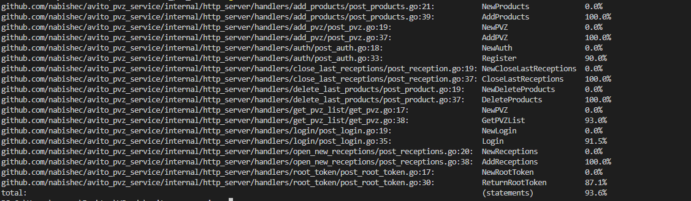

# 🛒 AVITO PVZ SERVICE

Этот проект представляет собой сервис для управления пунктами выдачи заказов (ПВЗ). Он предоставляет пользователям следующие возможности:

- Регистрация и авторизация.
- Создание и управление пунктами выдачи заказов.
- Добавление информации о приемке товаров.
- Управление товарами в рамках одной приемки: добавление и удаление (до закрытия приемки).
- Закрытие приемки.
- Получение списка пунктов выдачи заказов и подробной информации о них.

## 🚀 Установка и запуск

### Требования

- Docker и Docker Compose
- Go 1.24 или выше (для локальной разработки)

### Через Docker Compose

1. Клонируйте репозиторий:
```bash
git clone https://github.com/nabishec/avito_pvz_service.git
cd avito_pvz_service
```

2. Запустите проект:
```bash
docker-compose up -d
```

3. Сервис будет доступен по адресу: http://localhost:8080
4. Swagger документация: http://localhost:8080/swagger/

## ❗Решения
* В задании была ошибка, которая выражалась в том, что в openapi документации был employee, а в  задании client. Поэтому было принято решение везде использовать client.

* В задании было указано, что prometheus должен быть доступен по порту 9000, endpoint'у /metrics. Поэтому приложение передает свои метрики prometheus по порту 9090 внутри контейнера . А prometheus  к пользоват елю по порту 9000. И к метрикам приложения нет доступа с наружи контейнера.

* Также в файле .proto было enum, которое не используется в модели ПВЗ, и модели ответа grpc сервиса. Поэтому существование enum игнорировалось, и  по порту 3000 доступен grpc сервер, который возвращает список пвз, без поля активности подписок. 


## ⚠️ Обработка ошибок

В ручки добавлены следующие коды ошибок:
- **400 Bad Request** - некорректный запрос
- **401 Unauthorized** - проблема с аутентификацией
- **403 Forbidden** - доступ запрещен (когда роль не модератор и не клиент)
- **500 Internal Server Error** - внутренняя ошибка сервера

Формат даты в API: dateonly (YYYY-MM-DD)

## 📊 Модель данных

Проект использует следующую структуру базы данных:

- **users** - пользователи системы с ролями (client, moderator)
- **pvzs** - пункты выдачи заказов
- **receptions** - приемки товаров в ПВЗ
- **products** - товары, входящие в приемку

## 🧪 Тестирование

Был создан интеграционный [тест](integration_test/api_test.go)
```bash
go test ./integration_test/... 
```
А также юнит [тесты](internal/http_server/handlers) для бизнес логики.

Для проверки покрытия кода тестами:
```bash
go test ./internal/http_server/handlers/... -coverprofile cover.out 

go tool cover -func cover.out
```


(на снимке показан процент покрытия бизнес логики юнит тестами)

## 💻 Технический стек

- **Язык программирования**: Go 1.24
- **Web-фреймворк**: Chi
- **База данных**: PostgreSQL
- **Миграции**: Goose
- **Валидация**: go-playground/validator
- **Логгирование**: zerolog
- **Документация API**: Swagger
- **Аутентификация**: JWT
- **Контейнеризация**: Docker, Docker Compose

## 📄 Лицензия

[Apache License 2.0](LICENSE)
